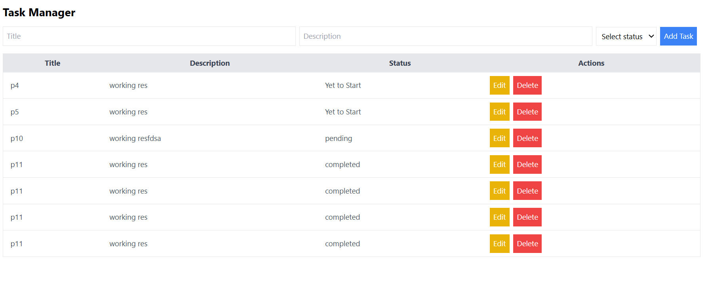

# compunent_connections
## Tech stack
Rect.js,Tailwind CSS,node.js,Express,mysql
## Frontend start
npm run start
## Backend 
npm run server

This application is currently only working locally. Since I am more experienced with MongoDB than MySQL, I explored MySQL for this assignment. I don't have knowledge of cloud MySQL

